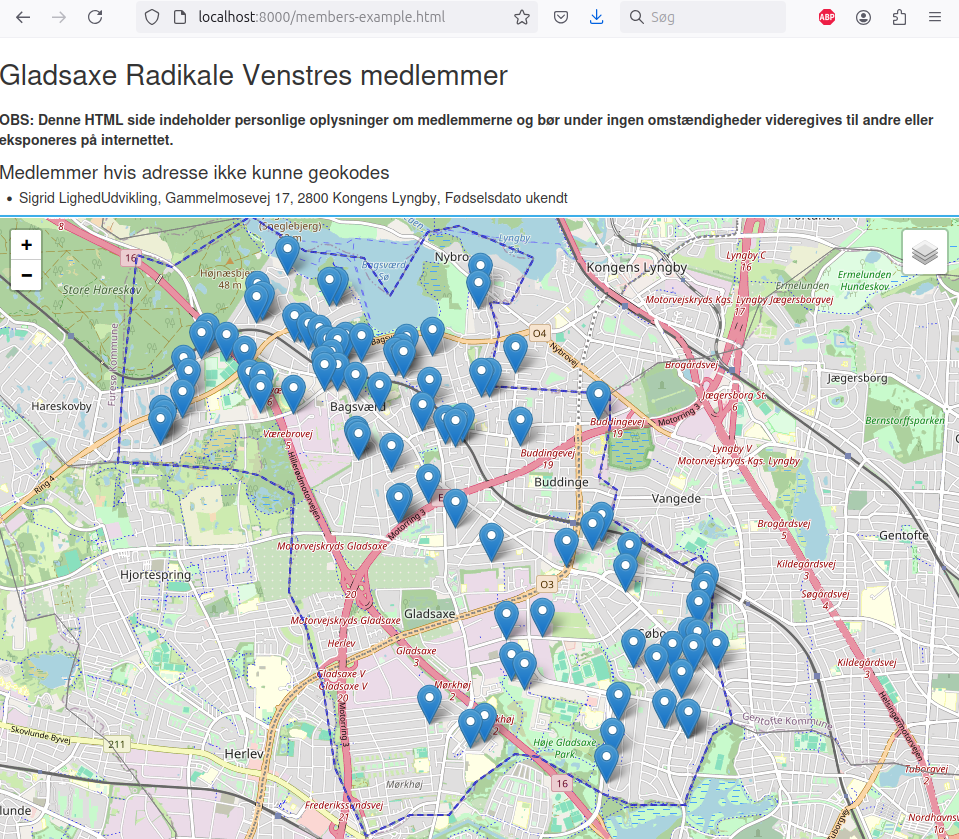

# Gladsaxe Radikale Venstre Scripts

Dette repo har et par filer og scripts der bruges af Gladsaxe Radikale Venstre til forskellige formål. Måske andre Radikale kan få gavn af dem.

## Formål

Der er to formål lige nu

* **Visualisering af medlemmers bopæl**, ud fra medlemsdatabasen. Dette kan bruges til overblik, f.eks. for at finde ud af hvor man bør placere arrangementer, hvor der med fordel kan uddele, planlægning af uddelingsruter, mv.
* **Overblik over møder**, ud fra flere forskellige kilder. Disse kilder stykkes manuelt sammen i en datafil, hvorefter der kan dannes et input til en online service der kan lave et kalenderoverblik. Det er old-school, men nyttigt.

### Advarsel

**Husk at medlemsdata er fortrolige**. Medlemsskab af partiforeninger har altid været omgærdet af særlige regler, også før GDPR. Undlad derfor at sætte et system op, der kan eksponere data til f.eks. internettet. Dette repositorie indeholder ingen data på medlemmer, kun syntetiske data til demonstrationsformål.


## Forberedelse

Disse scripts er udviklet og testet under Linux, men burde virke under Windows og Mac også. De kræver at man er fortrolig med at bruge en kommandlinie og har installeret Python.

For at køre scriptsene skal man 

* Have denne kode lokalt
* Opsætte et Python virtuelt miljø: `python -m venv venv`
* Loade det virtuelle miljø: `. venv/bin/activate`
* Installere de afhængigheder der mangler i det virtuelle miljø: `pip install -r requirements.txt`

Herefter kan man køre de forskellige scripts. De to hovedscripts accepterer en  `--help` option for at få lidt hjælp.

Alternativt indeholder [Makefilen](Makefile) targets der kan være behjælpelige med at køre dem. (Jeg sagde jo jeg var oldschool).


## Visualisering af medlemmers bopæl

Dette script laver en HTML fil, der har et interaktivt kort over medlemmerne i kommunen. Det kan bruges til at danne sig et overblik over hvor de bor, f.eks. for at se om man kan planlægge ruter til uddeling, mv.

Det kan f.eks. se sådan her ud: 



Der er eksempel på uddata [uddata](members-example.html) her.

Scriptet afhænger af at man har medlemsinformationen downloadet som Excel ark fra mit.radikale.dk. I filen [members-example.xlsx](members-example.xlsx) ligger et eksempel man kan bruge, som er baseret på syntetiske data fra Gladsaxe kommune.

Man kan køre scriptet på eksempel data, for at se hvordan scriptet fungerer, med følgende kommando:
```
./visualize-members.py members-example.xlsx members-example.html
```

Bemærk at scriptet er længe om at køre første gang, fordi den skal geokode adresserne. Det bliver "cachet", så det er hurtigere næste gang. Se nedenfor, for at se hvordan man viser den HTML side der blevet dannet.

### Workflow

Normalt vil man

* Downloade en liste over sine medlemmer til filen 'members.xlsx'
* Ændre i toppen af scriptet [visualize-members.py](visualize-members.py) så der rettes til ens egen kommune. Her kan man også tilføje lat/long for sin kommune (PR velkomment)
* Køre scriptet på medlemsdata i 'members.xlsx'
* Starte en lokal webserver i det katalog man har lavet filen i
* Navigere til den side man lige har dannet

Download af 'members.xlsx' ligger lidt uden for scope her. Det kan man, hvis man er foreningsformand eller sekretær. HUSK at medlemsdata er fortrolige.

Når man har filen `members.xlsx` så kan oprette sin HTML side f.eks. sådan her:

```
./visualize-members.py members.xlsx members.html
```

Scriptet er lidt langsomt den første gang, fordi det slår lat/long op for alle medlemmer i filen. Og for ikke at overbelaste den service der bruges til dette, holdes der en kort pause imellem hvert opslag. Lat long på kendte adresser gemmes dog imellem hver kørsel i filen `.geocache`, så det går betydeligt hurtigere næste gang.

Desuden hentes også information om kommunegrænser, der gemmes i filen `.municipalities.json`. Hvis kommunegrænserne en dag ændrer sig, bør denne fil slettes, så den kan blive hentet igen.

Bemærk, at der lejlighedsvist er adresser der ikke kan slås op. Information om medlemmer med adresser der ikke kan slås op, vil blive listet på HTML siden.

### Visning af html siden

For at se siden, bliver man nødt til at starte en http server lokalt

```
python -m http.server
```

Derefter skal man bruge sin browser til at gå til [http://localhost:8000/members.html](http://localhost:8000/members.html). Så man kan se et kort med medlemmerne på.

Det er muligt, at nogen browsere tillader at man åbner filen direkte fra disk. Ovenstående burde dog virke altid.

### Andre overlays

Det er muligt at lave overlays med "match grupper". Man kan lave en fil, kaldet `.match_groups.json` som indeholder en liste af navne, man vil have mappet ind i overlays. Se
filen `match_groups.json` for et eksempel.

### Adresser der er forkerte

Nogen medlemmer har forkert registrerede adresser, som ikke kan slås op. Man kan manuelt tilføje rettelser til sådanne i en fil kaldet `.address_rewrites.json`. Indholdet
er en JSON dict, med rettelser i. Se filen `address_rewrites.json` for et eksempel.

Nogen gange kan systemet finde adresser korrekt, selvom de er ufuldstændige, andre gange må man lave små justeringer ala ovenstående. Vores erfaring er at ca 3% af adresserne kan være problematiske. 

Når scriptet ikke kan finde en adresse, udskrives en linie der kan bruges som udgangspunkt til indhold i `.address_rewrites.json`

## Overblik over møder vha. Kalendersiden.dk

For at få et overblik over de mange møder der i DRV, kan man bruge scriptet [to-kalendersiden.py](to-kalendersiden.py).

Dette script, læser en fil kaldet [møder.yaml](møder.yaml) som indeholder erklæringer af møder og begivenheder i YAML format. Ud fra denne fil, dannes et stykke tekst, som kan anvendes på [kalendersiden](https://www.kalendersiden.dk/). Kalendersiden kan lave rimeligt fornuftige overblikskalendersider. Se et eksempel herunder:


Bemærk at det ikke er særligt automatisk. Workflow er ca. sådan her:

* Man opdaterer [møder.yaml](møder.yaml) filen i en teksteditor
* Man kører scriptet [to-kalendersiden.py](to-kalendersiden.py)
* Man åbner [kalendersiden](https://www.kalendersiden.dk/) i en browser
* Man kopierer teksten som scriptet har lavet over i kalendersiden og sætter evt. overskrift, mv.
* Man downloader en PDF med den dannede kalender

Igen, ret oldschool, men det virker. Så kan alle medlemmer af f.eks.en bestyrelse snakke ud fra samme overordnede plan.

Man kan afvikle scriptet vha. [Makefilen](Makefile).

En god måde at gøre det på, under Linux, kan være ved at køre denne kommando:

```
make clean kalendersiden.txt && xclip -selection clipboard kalendersiden.txt
```

Det putter den netop dannede tekst ind i clipboardet, så det kan pastes ind i Kalendersiden.

Bemærk iøvrigt at man kan oprette en bruger på Kalendersiden og gemme opsætning når man har oprettet en bruger. Det gør det lidt nemmere.
